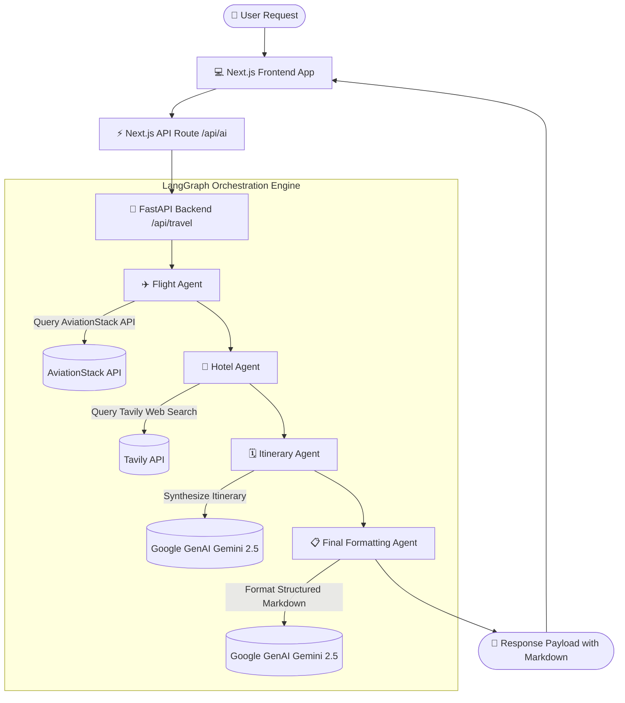

# ✈️ Triplanner (TripMate AI)

[](https://www.python.org/)
[](https://fastapi.tiangolo.com/)
[](https://www.langchain.com/langgraph)
[](https://nextjs.org/)
[](https://react.dev/)
[](https://tailwindcss.com/)

**Triplanner** (also known as **TripMate AI**) is a production-grade, multi-agent AI travel planning platform. It leverages **LangGraph**, **LangChain**, and **Google GenAI (Gemini 2.5 Flash)** to automatically fetch live flight availability, recommend top-rated hotels with direct booking links, and synthesize practical, budget-aware day-by-day itineraries.

---

## 📌 Table of Contents

- [Features](#-features)
- [Architecture & Multi-Agent Workflow](#-architecture--multi-agent-workflow)
- [Repository Structure](#-repository-structure)
- [Tech Stack](#-tech-stack)
- [Prerequisites](#-prerequisites)
- [Environment Configuration](#-environment-configuration)
- [Getting Started](#-getting-started)
  - [Backend Setup (FastAPI + LangGraph)](#1-backend-setup-fastapi--langgraph)
  - [Frontend Setup (Next.js)](#2-frontend-setup-nextjs)
- [Docker Deployment](#-docker-deployment)
- [API Reference](#-api-reference)
- [Performance & Security](#-performance--security)
- [License](#-license)

---

## ✨ Features

- 🤖 **Autonomous Multi-Agent System**: Sequential agent graph built with LangGraph for deterministic task delegation (Flight Agent → Hotel Agent → Itinerary Agent → Final Agent).
- ✈️ **Real-Time Flight Search**: Integrates AviationStack API with `airportsdata` & `pycountry` for dynamic IATA resolution and flight tracking.
- 🏨 **Live Hotel & Web Search**: Queries Tavily API for real-time hotel options, snippets, and direct web links.
- 🗓️ **Custom Day-by-Day Itineraries**: Synthesizes budget-aware, realistic travel plans using Google GenAI's high-speed `gemini-3.6-flash` LLM.
- ⚡ **100% Async Pipeline**: Fully asynchronous python backend (`httpx`, `ainvoke`, `AsyncClient`) to maximize throughput without blocking the event loop.
- 🎨 **Minimalist Sleek UI**: Next.js 16 frontend featuring a clean monochrome design system, interactive prompt shortcuts, clipboard copying, printing, and client-side markdown parsing via `marked`.
- 🐳 **Containerized & Production Ready**: Backend includes a optimized multi-stage Dockerfile powered by `uv` for ultra-fast dependency resolution.

---

## 🏗️ Architecture & Multi-Agent Workflow



### Agent Breakdown

1. **Flight Agent (`flight_agent`)**: Resolves destination countries/cities into IATA airport codes using `airportsdata` and `pycountry`, then queries AviationStack API for live flight routes and schedules.
2. **Hotel Agent (`hotel_agent`)**: Performs web searches via Tavily to retrieve top-rated hotels, estimated price ranges, and verified URLs.
3. **Itinerary Agent (`itinerary_agent`)**: Combines user preferences, flight data, and hotel information to construct a realistic, day-by-day travel schedule.
4. **Final Agent (`final_agent`)**: Formats all collected data into structured Markdown sections:
   - Trip Summary
   - Flight Information
   - Hotel Suggestions (with clickable URLs)
   - Day-by-Day Itinerary
   - Estimated Budget
   - Final Recommendations

---

## 📁 Repository Structure

```text
triplanner/
├── backend/                  # Python FastAPI & LangGraph Backend Service
│   ├── Agents_tools/         # Custom tools for AI Agents
│   │   ├── flight_tool.py    # AviationStack API integration & airport IATA lookups
│   │   └── tavily_tool.py    # Tavily Web Search integration (Async HTTPX)
│   ├── Backend.py            # LangGraph StateGraph, memory checkpointer & agent node logic
│   ├── main.py               # FastAPI web server, CORS middleware & route handlers
│   ├── requirements.txt      # Python dependencies
│   ├── Dockerfile            # Docker configuration using Astral's uv package manager
│   ├── .env.example          # Backend environment variable template
│   └── test.py               # Async CLI runner for backend debugging
│
└── frentend/                 # Next.js 16 Web Application Frontend
    ├── app/
    │   ├── api/ai/route.ts   # Next.js API route proxying requests to FastAPI
    │   ├── globals.css       # Monochrome CSS design system & Markdown styling
    │   ├── layout.tsx        # Application root layout & metadata
    │   └── page.tsx          # Interactive travel planner UI component
    ├── package.json          # Node.js dependencies & scripts
    ├── next.config.ts        # Next.js configuration
    └── tsconfig.json         # TypeScript configuration
```

---

## 🛠️ Tech Stack

### Backend (`backend/`)
- **Framework**: [FastAPI](https://fastapi.tiangolo.com/) + [Uvicorn](https://www.uvicorn.org/)
- **Agent Orchestration**: [LangGraph](https://www.langchain.com/langgraph) & [LangChain](https://www.langchain.com/)
- **LLM Provider**: [Google GenAI](https://ai.google.dev/) (`gemini-3.6-flash`)
- **HTTP Client**: [HTTPX](https://www.python-httpx.org/) (Async)
- **External APIs**: [AviationStack](https://aviationstack.com/), [Tavily AI](https://tavily.com/)
- **Data Tools**: `airportsdata`, `pycountry`
- **Package Management**: [`uv`](https://github.com/astral-sh/uv) & `pip`

### Frontend (`frentend/`)
- **Framework**: [Next.js 16](https://nextjs.org/) (App Router) + [React 19](https://react.dev/)
- **Language**: [TypeScript](https://www.typescriptlang.org/)
- **Styling**: [Tailwind CSS v4](https://tailwindcss.com/) + Custom CSS Variables
- **Markdown Renderer**: [`marked`](https://marked.js.org/)
- **HTTP Client**: [Axios](https://axios-http.com/)

---

## 📋 Prerequisites

Before running the application, ensure you have the following installed:
- **Python**: `3.11+` (Python 3.14 supported)
- **Node.js**: `18.x` or higher (or [Bun](https://bun.sh/))
- **Docker**: (Optional, for containerized execution)
- **API Keys Required**:
  - **Google GenAI API Key**: [Get Key](https://aistudio.google.com/)
  - **Tavily API Key**: [Get Key](https://tavily.com/)
  - **AviationStack API Key**: [Get Key](https://aviationstack.com/)

---

## ⚙️ Environment Configuration

### 1. Backend Environment Setup

Create a `.env` file inside the `backend/` folder:

```bash
cp backend/.env.example backend/.env
```

Populate `backend/.env` with your API credentials:

```env
# AI Model & Search Keys (Required)
GOOGLE_API_KEY=your_google_api_key_here
TAVILY_API_KEY=your_tavily_api_key_here
AVIATIONSTACK_API_KEY=your_aviationstack_api_key_here

# Configuration (Optional)
DEFAULT_ORIGIN_IATA=DEL

# Observability / LangSmith Tracing (Optional)
LANGSMITH_TRACING=false
LANGSMITH_API_KEY=
LANGSMITH_PROJECT=triplanner
```

### 2. Frontend Environment Setup

Create a `.env.local` file inside the `frentend/` folder:

```env
NEXT_PUBLIC_API_URL=http://127.0.0.1:8000
```

---

## 🚀 Getting Started

### 1. Backend Setup (FastAPI + LangGraph)

Navigate to the `backend` directory, create a virtual environment, install dependencies, and start the server:

```bash
# Navigate to backend
cd backend

# Create virtual environment
python -m venv .venv

# Activate virtual environment
# Windows (PowerShell):
.venv\Scripts\Activate.ps1
# Linux/macOS:
source .venv/bin/activate

# Install dependencies
pip install -r requirements.txt

# Start FastAPI server
python main.py
# Server will run on http://127.0.0.1:8000
```

To test the backend agent via CLI without starting FastAPI:
```bash
python test.py
```

### 2. Frontend Setup (Next.js)

Navigate to the `frentend` directory, install Node dependencies, and launch the development server:

```bash
# Navigate to frontend
cd frentend

# Install dependencies using Bun, NPM, or Yarn
bun install
# or: npm install

# Start Next.js development server
bun dev
# or: npm run dev

# Open http://localhost:3000 in your browser
```

---

## 🐳 Docker Deployment

The backend service includes a production Dockerfile leveraging Astral's `uv` installer for ultra-fast builds.

### Building and Running Backend Container

```bash
# Navigate to backend directory
cd backend

# Build Docker image
docker build -t triplanner-backend .

# Run Docker container
docker run -d \
  --name triplanner-backend \
  -p 8000:8000 \
  --env-file .env \
  triplanner-backend
```

Check API status at `http://localhost:8000/health`.

---

## 📡 API Reference

### Backend Endpoints (`http://localhost:8000`)

#### 1. `POST /api/travel`
Generates a full AI travel plan based on user prompt.

**Request Body**:
```json
{
  "message": "Plan a 7-day trip to Tokyo under 2 lakhs INR",
  "thread_id": "optional_session_uuid"
}
```

**Response Body**:
```json
{
  "success": true,
  "thread_id": "user_a1b2c3d4...",
  "answer": "# ✈️ Japan Travel Itinerary\n\n### 1. Trip Summary\n...",
  "flight_result": "...",
  "hotel_results": "...",
  "itinerary": "...",
  "llm_calls": 4
}
```

#### 2. `GET /health`
Returns system health status.

**Response**:
```json
{
  "status": "ok",
  "message": "AI Travel Planner API is running"
}
```

#### 3. `GET /`
Root welcome message.

---

## 🛡️ Performance & Security

- **Asynchronous Execution**: All HTTP network calls (AviationStack & Tavily) and LLM invocation calls (`ainvoke`) use non-blocking `async/await` patterns to guarantee high concurrency.
- **CORS Configured**: CORS middleware restricts allowed origins while enabling smooth communication between Next.js and FastAPI.
- **Thread Memory Checkpoint**: Utilizes LangGraph's `MemorySaver` to retain state and conversation threads per user session (`thread_id`).

---

## 📄 License

Distributed under the MIT License. See `LICENSE` for more details.
